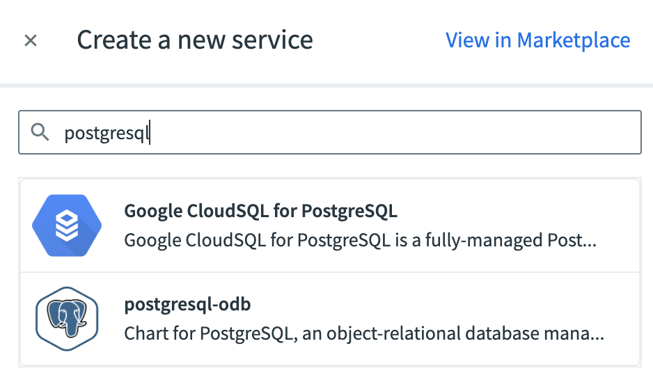
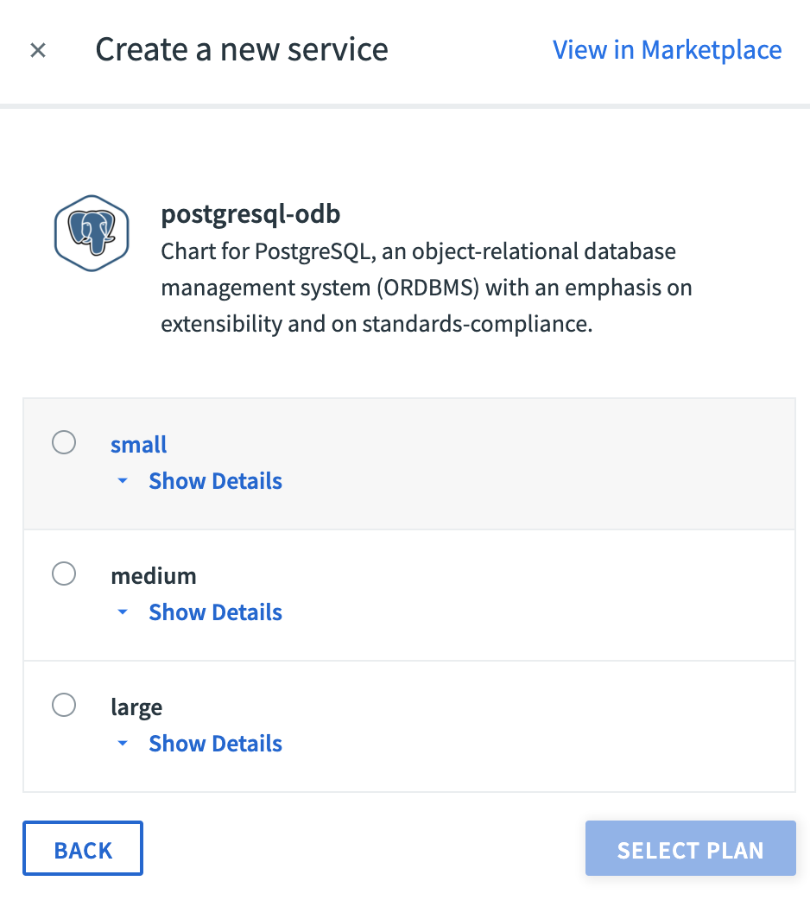
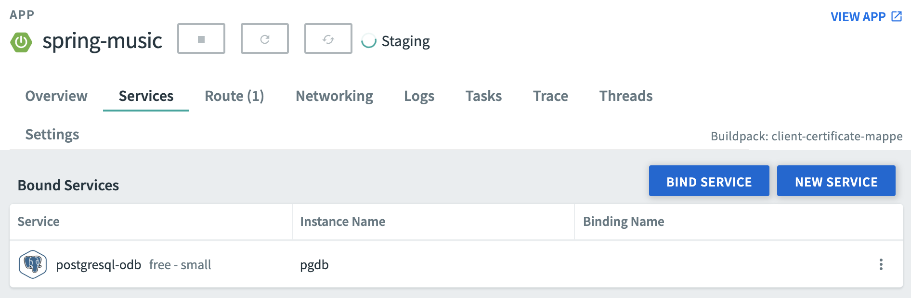
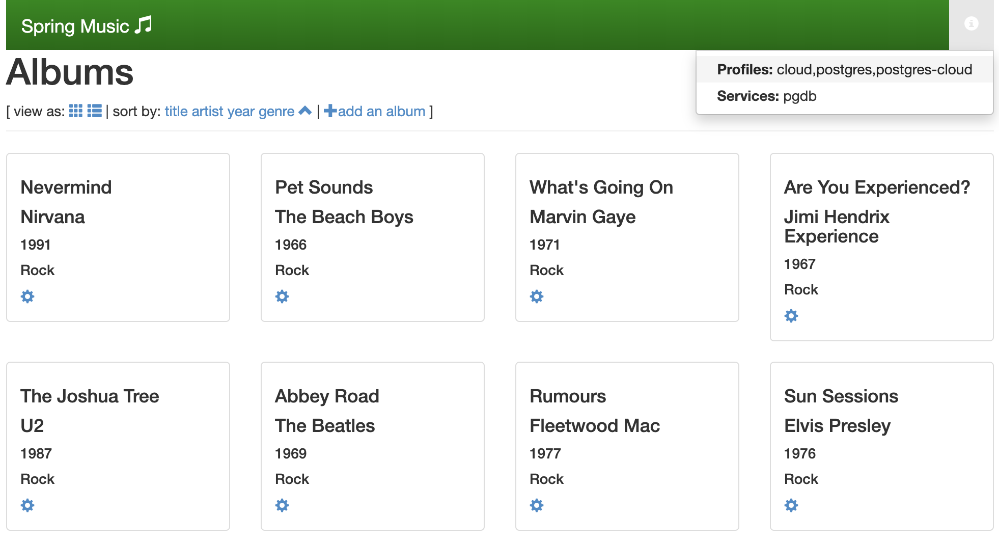

# Container Services Manager for Pivotal Platform 101

This project shows how to use
[Container Services Manager for Pivotal Platform](https://docs.pivotal.io/ksm/0-5/) (KSM)
to create and expose Kubernetes services to apps running on
[Pivotal Platform](https://pivotal.io/platform).

KSM was announced at [SpringOne Platform 2019](https://springoneplatform.io/2019):

[](https://www.youtube.com/embed/YbdUdml91Aw)

This repository contains a [PostgreSQL](https://postgresql.org)
on-demand service using the
[OSS Helm chart](https://github.com/helm/charts/tree/master/stable/postgresql).
Using KSM, you'll be able to create a PostgreSQL database instance
using `cf create-service`, and bind this instance to an app.
This way, your Pivotal Platform can create and consume Kubernetes services.

KSM also supports Kubernetes Operators.

## How to use it?

You first need to
[deploy KSM to your Kubernetes cluster](https://docs.pivotal.io/ksm/0-5/installing.html).

Package the PostgreSQL Helm chart:
```bash
$ make install
helm package services/postgresql-odb;
Successfully packaged chart and saved it to: /ksm101/postgresql-odb-6.5.2.tgz
```

The directory `services/postgresql-odb` contains the PostgreSQL Helm chart:
no modification was made except the chart name.

A KSM package may also
[include several Helm charts](https://docs.pivotal.io/ksm/0-5/prepare-offer.html#multiple-charts).

In order to use this Helm chart with KSM, you need to provide some files.

The directory `plans` defines options to create your database.
This service actually contains 3 plans: `small`, `medium`, and `large`.
Each plan is defined in this own file.

For example, here's the definition of plan `small`:
```yaml
postgresqlDatabase: db
service:
  type: LoadBalancer
persistence:
  size: 8Gi
```

A plan contains configuration properties which override default values
defined in the Helm chart in `values.yaml`.
Here we set a small persistence disk size for plan `small`.

A plan index file `plans.yaml` defines which plans are available:
```yaml
- name: "small"
  description: "Small size database"
  file: "small.yaml"
- name: "medium"
  description: "Medium size database"
  file: "medium.yaml"
- name: "large"
  description: "Large size database"
  file: "large.yaml"
```

The last file is `bind.yaml` which defines how to consume this service from Pivotal Platform.
This file is a template where you define service properties which are read by your apps
when the service is bound:
```yaml
template: |
  local filterfunc(j) = std.length(std.findSubstr("postgresql", j.name)) > 0;
  local s1 = std.filter(filterfunc, $.services);
  {
    hostname: s1[0].status.loadBalancer.ingress[0].ip,
    name: "db",
    jdbcUrl: "jdbc:postgresql://" + self.hostname + "/" + self.name + "?user=" + self.username + "&password=" + self.password + "&sslmode=disable",
    uri: "postgres://" + self.username + ":" + self.password + "@" + self.hostname + ":" + self.port + "/" + self.name,
    password: $.secrets[0].data['postgresql-password'],
    port: 5432,
    username: "postgres"
  }
```

Your KSM package is ready: let's deploy it!
Use `ksm` CLI to deploy this service:
```bash
$ ksm -t <KSM target> -u <KSM username> -p <KSM password> offer save postgresql-odb-6.5.2.tgz
```

Check this service is available in KSM:
```bash
$ ksm -t <KSM target> -u <KSM username> -p <KSM password> offer list
MARKETPLACE NAME	INCLUDED CHARTS	VERSION	PLANS
postgresql-odb  	postgresql-odb 	6.5.2  	[large medium small]
```

Check this service is available in Pivotal Platform marketplace:
```bash
$ cf marketplace -s postgresql-odb
Getting service plan information for service postgresql-odb as foo@pivotal.io...
OK

service plan   description            free or paid
small          Small size database    free
medium         Medium size database   free
large          Large size database    free
```

The service also appears in the UI:



Your service is ready to be consumed by apps!

Let's push a [sample app](https://github.com/cloudfoundry-samples/spring-music):
```bash
$ cd apps/spring-music
$ cf push
```

Create a new a PostgreSQL service instance:
```bash
$ cf create-service postgresql-odb small pgdb
Creating service instance pgdb in org Foo / space dev as foo@pivotal.io...
OK

Create in progress. Use 'cf services' or 'cf service pgdb' to check operation status.
```

The same command can be done using the UI:



If you look at your Kubernetes cluster, you should see a namespace for this service:
```bash
$ kubectl get ns
NAME                                          STATUS   AGE
default                                       Active   17h
kibosh                                        Active   12h
kibosh-e9b5590e-783f-444a-9d27-96cbb4493c71   Active   25m
kube-node-lease                               Active   17h
kube-public                                   Active   17h
kube-system                                   Active   17h
pks-system                                    Active   17h
```

Let's inspect this new namespace:
```bash
$ kubectl -n kibosh-e9b5590e-783f-444a-9d27-96cbb4493c71 get pods,pvc
NAME                              READY   STATUS    RESTARTS   AGE
pod/k-veyxllfu-postgresql-odb-0   1/1     Running   0          26m

NAME                                                     STATUS   VOLUME                                     CAPACITY   ACCESS MODES   STORAGECLASS   AGE
persistentvolumeclaim/data-k-veyxllfu-postgresql-odb-0   Bound    pvc-8ff20c4b-f6a5-11e9-950b-42010a000c0d   8Gi        RWO            standard       26m
```

Here they are: one pod for our PostgreSQL instance, and its persistent disk.

Bind this service to your app:
```bash
$ cf bind-service spring-music pgdb
Binding service pgdb to app spring-music in org Foo / space dev as foo@pivotal.io...
OK

TIP: Use 'cf restage spring-music' to ensure your env variable changes take effect
```

Using the UI:



Now restage your app to apply the service binding:
```bash
$ cf restage spring-music
```

The app is deployed to a random domain. Hit this domain and you should see
the database used by the app:



A PostgreSQL database instance was deployed to Kubernetes, with random credentials.
Thanks to KSM, you can easily create and bind Kubernetes services
to your apps running on Pivotal Platform.

## Contribute

Contributions are always welcome!

Feel free to open issues & send PR.

## License

Copyright &copy; 2019 [Pivotal Software, Inc](https://pivotal.io).

This project is licensed under the [Apache Software License version 2.0](https://www.apache.org/licenses/LICENSE-2.0).
